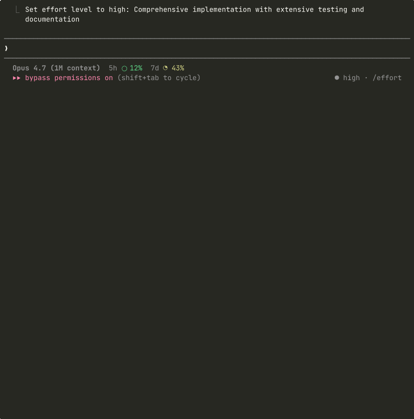

# e-Gov 法令API v2 対応 Claude スキル — 解説

このディレクトリにある `SKILL.md` は、 **Claude Code / Claude Agent SDK に読み込ませる「スキル定義ファイル」** です。AI エージェント（Anthropic の Claude 等）が e-Gov 法令 API v2 を呼び出すときの挙動指針として機能します。

本ドキュメントは `SKILL.md` の役割と設計意図を、e-Gov API に精通した読者向けに日本語で解説するものです。API の仕様そのものには踏み込まず、AI エージェント連携の観点に絞ります。

**出典**: `SKILL.md` の記述は e-Gov 法令 API v2 の公式仕様（OpenAPI / Swagger UI: <https://laws.e-gov.go.jp/api/2/swagger-ui>）に準拠しています。



---

## 1. スキル定義ファイル (`SKILL.md`) とは

Claude Code は、ユーザー発話と `SKILL.md` 冒頭 YAML の `description` フィールドを照合し、合致するスキルを**自動的にコンテキストへ注入**します。明示的な `import` は不要で、発話コンテキストそのものがトリガーです。スキル本文にはエンドポイント一覧・パラメータ・落とし穴・エラー辞典が記載されており、Claude はこれを参照しながら HTTP リクエストを組み立てます。

配置は `.claude/skills/egov-law-api/`（プロジェクトスコープ）または `~/.claude/skills/egov-law-api/`（ユーザースコープ）に置くだけです。

---

## 2. AI エージェント向けの設計ポイント

`SKILL.md` の記述は **「Claude がハマりやすい・失敗しやすい箇所の事前予防」** として選定しています。

- **`elm` の強調**: 大規模法令の全文取得は LLM コンテキスト窓を圧迫するため、条項単位の部分抽出を既定戦略に
- **`law_full_text_format` の一致**: 不一致時の Base64 返却はエージェントにとって実質不可読＆トークン浪費
- **`Misc` が空である旨の明記**: 告示系の空振りリクエスト反復を抑止
- **消費改正法の 404**: 法令番号を変えた再試行ループを避けるため代替経路（NDL 日本法令索引 API）に誘導
- **`asof` の下限（2017-04-01）**: 範囲外指定での即時 400 エラーを回避
- **レート制限**: 明文規定はないため、バースト抑制と XML 一括ダウンロードへの誘導を記載

---

## 3. エージェント対話例

### 例 A: 特定時点の条文取得

**ユーザー**: 「労働基準法第32条を2018年4月時点でどうなっていたか見せて」

**内部推論**: `/laws` で law_id を解決（`322AC0000000049`）→ `asof` が下限以降か確認 → `elm` で 32 条のみ抽出 → 両 `format` を揃える。

```bash
curl 'https://laws.e-gov.go.jp/api/2/law_data/322AC0000000049?asof=2018-04-01&elm=MainProvision-Article_32&response_format=json&law_full_text_format=json'
```

レスポンス骨格（抜粋）:
```json
{
  "revision_info": {
    "law_revision_id": "322AC0000000049_20170602_429AC0000000045",
    "law_title": "労働基準法",
    "amendment_enforcement_date": "2017-06-02"
  },
  "law_full_text": {
    "tag": "Article", "attr": { "Num": "32" },
    "children": [
      { "tag": "ArticleCaption", "children": ["（労働時間）"] },
      { "tag": "ArticleTitle", "children": ["第三十二条"] },
      { "tag": "Paragraph", "attr": { "Num": "1" }, ... }
    ]
  }
}
```

第32条（労働時間）の本文と見出し、施行日を構造化してユーザーに応答。

### 例 B: 全文キーワード検索

**ユーザー**: 「『育児休業』に言及している法令を上位3件探して」

**内部推論**: `/keyword` に `limit=3` で問い合わせ。

```bash
curl 'https://laws.e-gov.go.jp/api/2/keyword?keyword=育児休業&limit=3&response_format=json'
```

レスポンス骨格（抜粋）:
```json
{
  "total_count": 1912,
  "next_offset": 3,
  "items": [
    {
      "law_info": { "law_title": "健康保険法", ... },
      "sentences": [
        { "position": "caption", "text": "（<span>育児休業</span>等を終了した際の改定）" },
        { "position": "mainprovision", "text": "保険者等は、<span>育児休業</span>、介護休業等..." }
      ]
    }
  ]
}
```

1,912 件中の上位 3 件を法令名・マッチ位置つきで提示。続きは `next_offset=3` で取得。
